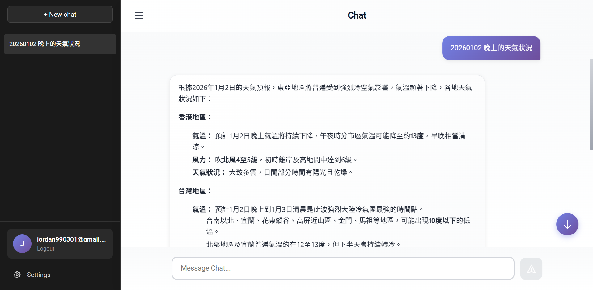
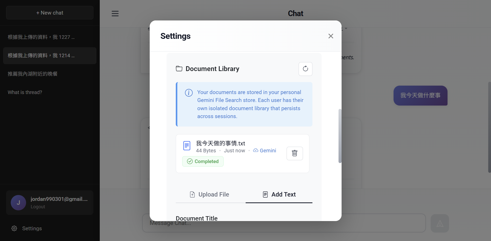
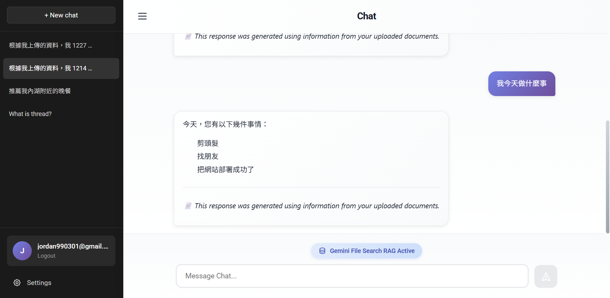

# RAG Chat Application

A full-stack **Retrieval-Augmented Generation (RAG)** chat application that combines LLM capabilities with document-based knowledge retrieval. Upload documents, build a knowledge base, and chat with AI using context-aware responses.

**Visit site**: https://zhirong-chat.zeabur.app/

## Features

### Core Features

- **RAG-Enhanced Chat**: Chat with AI using standard LLM responses or RAG-enhanced responses with document context
- **LangGraph Agent System**: Multi-step reasoning with integrated search capabilities (Google via Serper, Tavily Search)
- **Document Management**: Upload and manage PDF, TXT, Markdown, DOCX, JSON, CSV, and more
- **Multi-Provider LLM Support**: Gemini, OpenAI, and Anthropic API key options
- **Gemini File Search**: Automatic document indexing, embedding, and semantic retrieval with per-user stores

### Authentication & Security

- **User Authentication**: JWT-based authentication with bcrypt password hashing
- **Email Verification**: Required email verification for new user accounts via Gmail SMTP
- **Password Reset**: Secure password reset flow with email-based JWT tokens

### Development & Deployment

- **Real-time Updates**: Hot reload for development (frontend and backend)
- **Database Migrations**: Alembic-based migration system for schema changes
- **Form Validation**: VeeValidate with Yup schemas for robust input validation
- **Comprehensive Testing**: pytest (backend), Vitest (frontend unit), Playwright (E2E)
- **Dockerized**: Easy deployment with Docker Compose (dev and production modes)
- **Utility Scripts**: Makefile and shell scripts for common operations
- **Automated Deployment**: Continuous deployment via [Zeabur](https://zeabur.com) - automatically builds and deploys on every push to GitHub

## Screenshots

### LangGraph Workflow

The agent uses a multi-node graph for intelligent processing:

```
┌──────────┐
│ Analyzer │ - Analyzes query and decides if search is needed
└────┬─────┘
     │
     ├─── needs_search? ───┐
     │                     │
     ▼                     ▼
┌────────┐           ┌─────────┐
│ Search │           │ Respond │
└───┬────┘           └─────────┘
    │
    ▼
┌──────────┐
│ Responder│ - Generates final response with search context
└──────────┘
```

### LLM Response with Web Search Results



### RAG Implementation with Gemini File Search API





## Tech Stack

### Backend

- **Framework**: FastAPI with Uvicorn/Gunicorn
- **Database**: PostgreSQL 16 with SQLModel ORM
- **Caching & Rate Limiting**: Redis 7 with sliding window rate limiter
- **Authentication**: JWT tokens with bcrypt password hashing
- **AI/ML**:
  - LLM Providers: Gemini, OpenAI, Anthropic (via Langchain)
  - Agent Framework: LangGraph for multi-step reasoning
  - RAG: Gemini File Search API
  - Search Tools: Serper (Google Search), Tavily Search
- **Email**: Gmail SMTP for verification and password reset
- **Migrations**: Alembic for database schema management
- **Testing**: pytest with coverage

### Frontend

- **Framework**: Vue 3.5 with TypeScript 5.9
- **Build Tool**: Vite 7.1
- **State Management**: Pinia 3.0
- **Routing**: Vue Router 4.5
- **UI Framework**: Bootstrap 5.3 with Bootstrap Icons
- **Form Validation**: VeeValidate 4.15 with Yup
- **Markdown**: Marked 17.0 with Highlight.js 11.11 for code highlighting
- **Testing**: Vitest (unit), Playwright (E2E)

### Infrastructure

- **Containerization**: Docker with Docker Compose
- **Caching**: Redis 7 (Alpine) for rate limiting and session management
- **Web Server**: Nginx (production)
- **Deployment**: [Zeabur](https://zeabur.com) - Serverless cloud platform with GitHub integration for automated CI/CD

## Utility Scripts

The `scripts/` directory contains helpful tools for development and operations:

### Redis Monitoring

Redis is used for rate limiting (20 messages per 30 minutes per user).

**Quick Monitor (Shell Script)**:

```bash
./scripts/redis-monitor.sh
```

### Other Scripts

- `scripts/dev.sh` - Start development environment
- `scripts/prod.sh` - Start production environment
- `scripts/logs.sh` - View application logs
- `scripts/health-check.sh` - Check service health
- `scripts/db-backup.sh` / `scripts/db-restore.sh` - Database backup/restore
